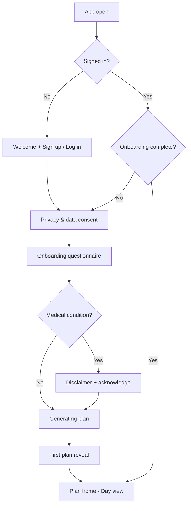

# MealMind — Onboarding & First-Plan UX Flow

Derived from `PRD_AI_Diet_Planner_App.md` + `ROADMAP.md` (P0.1)  
Status: Working draft for design / eng handoff  
Platform: iOS + Android (same flow)

---

## Goal

Get a new user from install → **first personalized weekly plan** in under ~3 minutes, with medical/privacy trust steps that don't kill activation.

**Success for this flow:** user sees Day 1 of a credible plan and understands the three meal actions (Swap / Don't like / Regenerate day) plus Ate / Swapped / Skipped.

---

## High-level flow

---

## Screen-by-screen

### 0. Welcome
- **Purpose:** Positioning in one line + CTA  
- **Copy cue:** "Plans that fit your life — AI nutrition on dietician-validated guidelines."  
- **Actions:** Create account / Log in  
- **Notes:** No feature dump. Skip "free forever" language (MVP has 3-day trial later in P1).

### 1. Auth
- Email / phone / social as eng chooses; product only needs a stable account id.  
- After auth → Privacy consent (first time).

### 2. Privacy & data consent (DPDP)
- Short plain-language summary: we collect age, weight, optional medical info to personalize plans.  
- Link to full privacy policy.  
- **Required** checkbox/consent before continuing.  
- No plan generation without this.

### 3. Onboarding questionnaire

One question per screen (or tight grouped pairs). Progress indicator (e.g. 3/11). Allow Back. Save answers as they go (resume if drop-off).

| # | Field | UI | Required | Notes |
|---|--------|-----|----------|-------|
| 1 | Primary goal | Single select | Yes | Healthy lifestyle, weight loss, muscle gain, maintenance, other |
| 2 | Daily routine | Single select | Yes | Hectic / some time / flexible for prep & workouts |
| 3 | Age | Number | Yes | |
| 4 | Gender | Single select | Yes | Include prefer-not-to-say if policy allows |
| 5 | Height & weight | Dual input + unit toggle | Yes | Metric default for India (cm / kg) |
| 6 | Activity level | Single select | Yes | Sedentary / Lightly / Moderately / Very active |
| 7 | Medical conditions | Optional tags + "None" | No | Freeform/tag; triggers disclaimer path |
| 8 | Cooking skill | Single select | Yes | Beginner / Comfortable / Advanced (air fryer vs stove = later) |
| 9 | Dietary preference | Single select | Yes | `diet_type`: vegetarian (no meat/fish/eggs, dairy OK — "Indian vegetarian"), eggetarian (vegetarian + eggs), non_vegetarian |
| 9b | Meats to avoid | Multi-select chips | No | Only shown if non_vegetarian. Options: beef, pork, mutton, seafood. Label: "I don't eat" |
| 10 | Cuisine preference | Multi-select chips | Yes (≥1) | Indian (general), North Indian, South Indian, Chinese, Asian |
| 11 | Allergens | Tag input | No | Editable anytime in Profile |

**Diet filter rules:**
- Vegetarian: hard-exclude egg, meat, fish dishes. Do not also add egg as an allergen (engine handles it).
- Eggetarian: hard-exclude meat, fish dishes.
- Cuisine is preference weighting; allergens are medical/intolerance hard exclusions.

**Out of scope until catalog coverage:** vegan, Jain/Satvik, pescatarian, flexitarian.

**Empty states:** If user skips optional medical/allergens, treat as none — don't block.

### 4. Medical disclaimer (conditional)
**Show if** any medical condition is set.

- Full-screen, not a tiny modal.  
- Copy (product intent): *"This app does not provide medical advice. Please consult your doctor before following this plan."*  
- Primary CTA: **I understand — continue** (must tap).  
- Secondary: Edit conditions / go back.  
- **Behavior:** until acknowledged → user gets a **limited plan** (PRD §6.2), not full personalization. Show a persistent banner on plan home: "Limited plan — medical disclaimer applies."

Also show disclaimer again whenever a plan or recipe is delivered to a flagged user (not one-time only).

### 5. Generating plan
- 3–8s branded wait state with rotating tips ("Balancing your week…", cuisine callouts).  
- If generation fails: retry + "We'll email when ready" fallback (eng detail).  
- Do **not** show a blank plan screen.

### 6. First plan reveal (moment of wow)
- Headline: "Your week is ready" + goal echo ("Built for weight loss · North Indian + Asian").  
- Preview strip: 7 day pills; default select **Today / Day 1**.  
- Primary CTA: **See today's meals**.  
- Soft secondary: "How this works" (one sheet: Swap, Don't like, Regenerate, tracking).

### 7. Plan home — Day view (default home after onboarding)

**Layout**
- Top: day selector (D1–D7) + festive/cheat badges if applicable  
- Meal cards stacked (e.g. Breakfast / Lunch / Snack / Dinner — exact slots from nutrition rules)  
- Each card: dish name, short line (cuisine / prep vibe), photo placeholder, overflow menu

**Per-meal actions**
| Action | Behavior | UX |
|--------|----------|-----|
| Swap | AI replaces meal; keep day balance | Instant optimistic UI + "Swapped" toast |
| Don't like | Learn avoidance; offer swap | Confirm chip: "We'll avoid this next time" |
| Open recipe | Preview (name/photo/desc); full steps gated in P1 | For P0: show preview + "Full recipe soon" or stub |

**Day-level actions**
- Regenerate day (confirm sheet: "Replace all meals today?")  
- Mark cheat day / festive day (manual); festive also auto from calendar later  

**Tracking (bottom of each meal or swipe)**
- Ate it / Swapped it / Skipped it — single tap, always visible after first reveal coach mark once.

### 8. Empty / edge cases
- Offline: show last cached plan; disable regenerate/swap with reason.  
- No cuisines selected: block continue on Q10.  
- User with medical flag + no ack: cannot dismiss limited-plan banner without ack.

---

## Coach marks (first session only)

1. On first plan reveal — "This is your week. Tap a day to peek ahead."  
2. On first meal card — "Don't love it? Swap or tell us you don't like it."  
3. After first meal interaction — "Log Ate / Swapped / Skipped so plans get smarter."

Dismissible; never block the primary CTA.

---

## Information architecture (post-onboarding tabs)

Suggested MVP shell (P0):

| Tab | Contents |
|-----|----------|
| Plan | Day view (this doc) |
| Library | Recipe browse — stub/preview in P0; paywall in P1 |
| Progress | Streaks stub in P0; full in P1 |
| Profile | Goals, allergens, cuisines, medical, privacy, logout |

---

## Copy principles
- Prefer "AI-powered, built on dietician-validated guidelines" — never "dietician-approved plan."  
- Cheat day ≠ free-for-all; festive = healthier festive variants.  
- Keep medical language calm and clear; no scare walls beyond what's required.

---

## Analytics events (instrument from P0)

| Event | When |
|-------|------|
| `onboarding_started` | First questionnaire screen |
| `onboarding_step_completed` | Each step id |
| `onboarding_completed` | Submit questionnaire |
| `disclaimer_shown` / `disclaimer_accepted` | Medical path |
| `plan_generation_started` / `succeeded` / `failed` | Generate |
| `first_plan_viewed` | Reveal or Day 1 view |
| `meal_swapped` / `meal_disliked` / `day_regenerated` | Actions |
| `meal_logged` | Ate / Swapped / Skipped + meal id |

Activation metric (PRD): signup → onboarding complete → `first_plan_viewed`.

---

## Out of scope for this flow (P1+)
- Paywall, trial countdown, recipe purchase  
- Streaks/badges UI polish  
- Video recipes, grocery, wearables  

---

## Open UX decisions (need design/product call)

1. **Meal slot set** — fixed 3 meals + snack vs flexible by routine answer  
2. **Limited plan** — what exactly is reduced vs full plan (fewer swaps? generic meals?)  
3. **Auth method** priority for India (phone OTP vs email/Google/Apple)  
4. **Units** — kg/cm only vs lb/ft toggle  

**Suggested defaults until decided:** 3 meals + 1 snack; limited plan = generic calorie-band meals + banner, swaps allowed but "don't like" learning deferred until ack; phone OTP + Google/Apple; kg/cm default with toggle.

---

## Handoff checklist

- [ ] Design: wireframes for screens 0–7 + coach marks  
- [ ] Eng: onboarding state machine + resume  
- [ ] Eng: plan generate API contract from questionnaire payload  
- [ ] Content: final disclaimer + privacy short text (legal later)  
- [ ] Product: resolve 4 open UX decisions above  

## Next product artifact
AI static knowledge-base / plan-generation technical scoping (inputs → constraints → output schema) so eng can build behind this UX.
